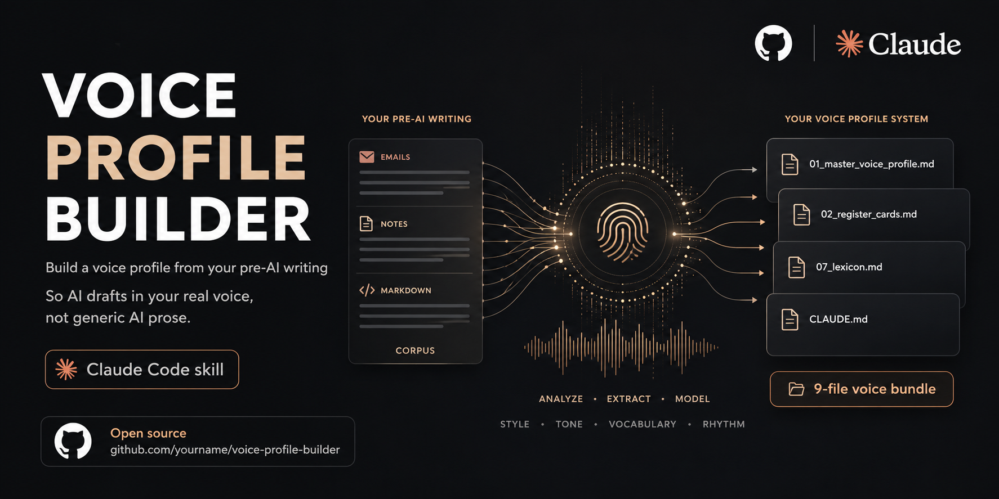

# Voice Profile Builder

Build a voice profile from your own writing so AI drafts in *your* voice, not in generic AI prose. The twist: it works best when you feed it writing you produced **before ChatGPT existed.**

## The idea in one paragraph

Everyone is teaching AI to sound like them using their recent writing. But recent writing is already half-AI. Every email you "cleaned up" with ChatGPT, every post a model helped you phrase, quietly poisons the sample. This tool goes the other way. It builds your profile from a corpus written **before late November 2022**, when the source was still purely you, then packages that into a multi-file system an AI loads before it writes a single word. Most voice tools humanize the output. This one fixes the input.

It is the difference between laundering AI text until a detector passes and never sounding like AI in the first place.

## What you get

A nine-file bundle the builder writes to a directory you choose:

| File | Role |
|---|---|
| `01_master_voice_profile.md` | Identity layer: who you are on the page, non-negotiables, a paste-ready instruction block |
| `02_register_cards.md` | One card per context (email, customer service, family, strategy, social, memoir) |
| `03_prompt_pack.md` | Copy-paste prompts for drafting and rewriting per register |
| `04_evaluation_checklist.md` | A scorecard that catches AI slop before you ship |
| `05_calibration_examples.md` | One verbatim example per register, pulled from your corpus |
| `06_style_guide.md` | The operational distillation: five non-negotiables, what you never do |
| `07_lexicon.md` | A verbatim phrase bank: your greetings, closers, typos, punctuation |
| `corpus.md` | Your cleaned source, sorted by register (private, never published) |
| `CLAUDE.md` | Loader instructions so future AI sessions know which files to read |

See [`examples/`](examples/) for a complete synthetic bundle built from a fictional person, so you can see the shape of the output without anyone's private writing.

## Before you start: build a corpus

You need **one file** of your own writing. Plain text or Markdown. At least 20,000 words, ideally pre-January 2023. The manual path that always works:

1. Search your Gmail **Sent** folder on your own address, filtered to before 2023.
2. Keep threads where the writing is clearly yours, not forwarded or AI-assisted.
3. Strip the other person's words. Keep only yours.
4. Paste it all into one document. **Do not clean it up.** Typos, run-ons, and rough phrasing are the point.

### Faster: let an AI email connector do the digging

If you have an AI assistant connected to your inbox (for example Claude's Gmail connector), you can skip the manual export. Point it at your mail and have it pull and assemble the corpus, then run the contamination scan in the same pass. Using AI to *find and gather* your writing is fine. It is retrieving, not drafting. The thing you are avoiding is AI that *wrote* the words in the first place.

The trick is the search strategy. Don't just grab your most recent or your "best" email. Deliberately pull every kind of email so the corpus covers your real range:

- **Work emails** (how you write under professional constraint)
- **Personal emails** (your unguarded default)
- **Emails to family** (warmth, informality)
- **Emails where you push back** (how you hold a line)
- **Emails where you are excited or celebrating** (your high-energy register)

Width matters more than polish. The more kinds of email you include, the more registers the profile can cover. A corpus that is 90% work email will only write work email well.

> Why pre-2023? See [`docs/WHY-PRE-AI-CORPUS.md`](docs/WHY-PRE-AI-CORPUS.md).

## Run it (Claude Code)

This ships as a [Claude Code skill](https://docs.claude.com/en/docs/claude-code). Two ways to install:

**Option A: clone and copy the skill**

```bash
git clone https://github.com/paultaki/voice-profile-builder.git
mkdir -p ~/.claude/skills/voice-profile-builder
cp voice-profile-builder/SKILL.md ~/.claude/skills/voice-profile-builder/SKILL.md
```

Then, from any directory, tell Claude Code:

```text
Use the voice-profile-builder skill on the corpus at <path>, write the bundle to <directory>.
```

**Option B: one-paste install**

If you would rather not clone, paste the block in [`install-prompt.md`](install-prompt.md) into a fresh Claude Code session at your home directory. It installs the skill, then runs it end to end.

## How it works

1. **Intake and contamination scan.** Reads your corpus, reports word count and coverage, and flags AI-fingerprint phrases (em-dashes, "leverage", "thrilled to announce", and friends). It flags, it never deletes. You decide what is really you.
2. **Register sort.** Groups your writing into up to eight registers. Thin registers get a "draft with caution" flag so the AI does not fake a voice it has not seen.
3. **Pattern extraction.** Pulls verbatim greetings, closers, sentence rhythm, signature typos, and the words you *never* use. Absence is signal.
4. **Bundle.** Writes the nine files above.
5. **Verify.** Generates a test draft in each register, scores it, and tells you to read it aloud before trusting it.

## Hard rules the builder follows

- **Never invents a quote.** Every phrase in the lexicon must exist verbatim in your corpus.
- **Never publishes your corpus.** The method is shareable. Your private writing is not. (`.gitignore` here is set up to keep it out of git.)
- **No em-dashes** unless your corpus consistently uses them.
- **Flags, never auto-cuts.** You approve every contamination removal.

## Privacy

Your corpus is your real, private correspondence. **Do not commit it, and do not publish it.** The `.gitignore` in this repo blocks `corpus.md` by default (add your own filename if you named it something else). Share the profile and the method. Keep the source to yourself.

## License

MIT. Fork it, adapt it, build your own. See [`LICENSE`](LICENSE).
